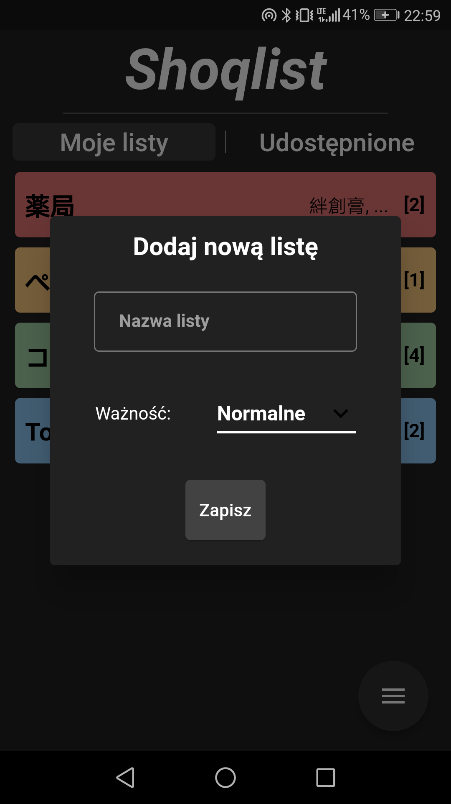
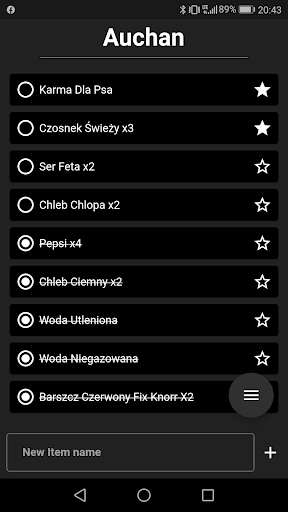
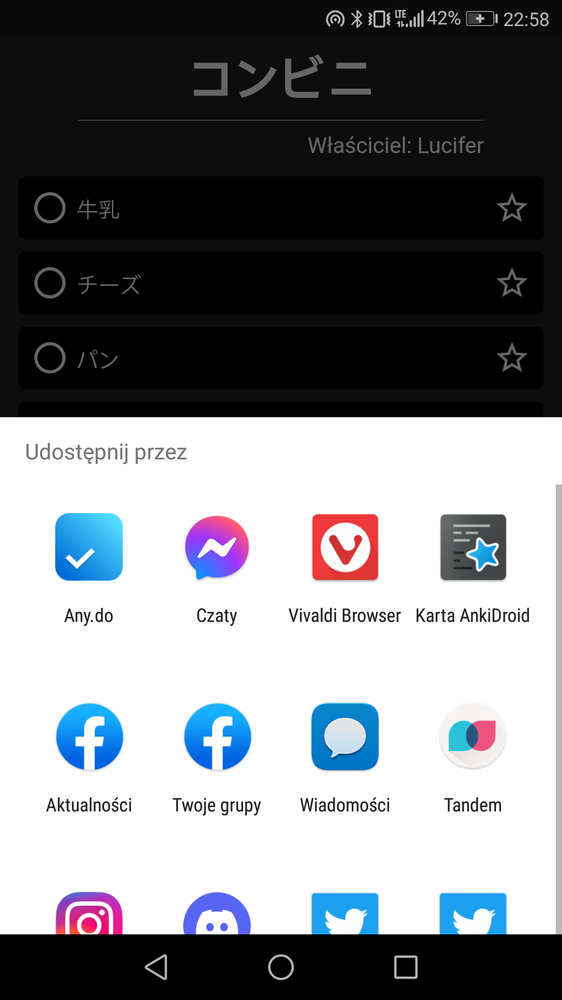
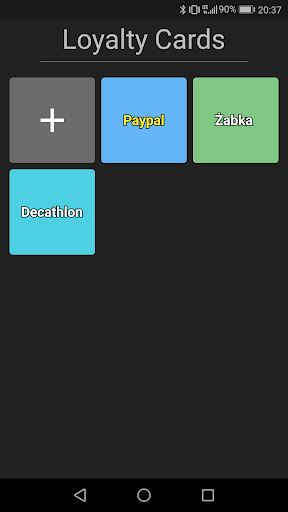
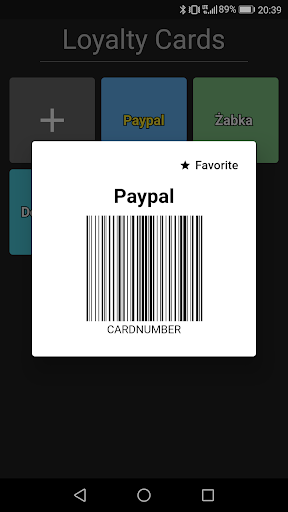
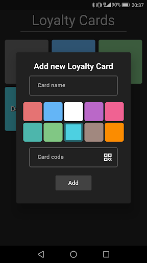

<a href = "https://play.google.com/store/apps/details?id=com.jocs.shoqlist">
  
</a>

# Shoqlist

Shoqlist is an app for creating and sharing shopping lists. In addition to basic functionality, it also has the option to scan loyalty cards and store digital versions of them.

## **Home Page**

The main page of the app displays shopping lists created by the user. The user can edit and delete lists by holding down a list for a little time. Moreover, the user has a menu where they can create a new shopping list and navigate to loyalty cards or settings (the option to scan the list will be available in the future).
<div align='center'>
</div>

## **Shopping List's display**

When you click on a shopping list tile, you will be taken to a page where you can see what the list contains. Using the entry box at the bottom of the screen, the user can quickly add more items to the shopping list. With a long press on any item, the user has the option to delete the item. Additionally, by simply clicking on an item, the user can mark or unmark it as done - the done items will be moved to the bottom of the list. On the other hand, if the user clicks on the star, the item will be set as favorite and thrown to the top of the list.
Next feature is the ability to share the list using the classic sharing tool built into Android. The last feature is in-app sharing, you can give access to one of your friends.
<div align='center'></div>
Below I show what a text file that is shared looks like.
<div align='center'></div>

## **Loyalty Cards**

Users can store their loyalty cards in the app - saving space in their wallet. By clicking on a tile that represents a loyalty card - the user is able to view the barcode for that card and possibly set that card as a favorite so it will be displayed first. Besides, with the long press the user can delete a particular card. By clicking the first plus tile, the user can add a new loyalty card. The card code can be entered manually or scanned by clicking the scan icon to the right of the text entry field.
<div align='center'></div>

## **Friends**

In the app, you can add other users as friends. Using the search engine, simply enter the exact email of the user you want to add to your friends and send a friend invitation. Then, the other person has to accept the invitation to become a friend so that both people can be friends and share shopping lists
<div align='center'></div>

## **Backend**

Because the application is intended to be used to quickly record things to buy, two NoSQL databases are implemented in Shoqlist. One is in the cloud (Firestore) and the other is local (Hive). Thanks to this solution, the user is not dependent on internet connection.

Below is how the shopping list data is stored in firestore.
```dart
users
    .doc(_firebaseAuth.auth.currentUser.uid)
    .collection('lists')
    .doc(documentId)
    .set({
        'name': name,         //Bakery
        'importance': _toolsVM.getImportanceLabel(importance), //Urgent
        'listContent': [],    //[Garlic Baguette, Bread, Buns]
        'listState': [],      //[false, false, true]
        'listFavorite': [],   //[true, false, false]
        'id': documentId      //STTgMxILcyTSpvv7C_7R5
    })
    .then((value) => print("Created new list"))
    .catchError((error) => print("Failed to create list: $error"));
```
In the case of Hive, you just need to extend the models accordingly, based on which Hive automatically generates adapters.
```dart
@HiveType(typeId: 0)
class ShoppingList extends HiveObject {
  @HiveField(0)
  String name;
  @HiveField(1)
  final List<ShoppingListItem> list;
  @HiveField(2)
  Importance importance;
  @HiveField(3)
  final String documentId;

  ShoppingList(this.name, this.list, this.importance, this.documentId);
}
```
The advantage of using two databases is that the application can run offline. However, this solution causes additional problems that need to be solved. The basic problem is synchronization. The application somehow needs to know which data - local or in the cloud - should be displayed. Due to the fact that the application does not store very large data, nor are they so complicated - in solving this problem I used timestamps. 

In short, every time the data is modified, the timestamp in both databases is updated. If the application has no internet connection, only the local timestamp is overwritten. The next time the internet connection state changes, the timestamps between the two databases are compared and the version that is newer is selected.
```dart
void compareDiscrepanciesBetweenCloudAndLocalData() {
  int localTimestamp = _shoppingListsVM.getLocalTimestamp();
  if (localTimestamp == null || _cloudTimestamp >= localTimestamp) {
     return addFetchedShoppingListsDataToLocalList();
  }
  return putLocalShoppingListsDataToFirebase();
}
```
```dart
void whenInternetConnectionIsRestoredCompareDatabasesAgain() {
  Connectivity().onConnectivityChanged.listen((ConnectivityResult result) {
   if (result == ConnectivityResult.mobile ||
       result == ConnectivityResult.wifi) {
     context.read(firebaseProvider).getShoppingListsFromFirebase(true);
   }
 });
}
```

## **Internalization**
With l10n, the application supports three different language versions: English, Polish and Japanese. The application version changes based on the current system language. 

Below I will show what the word file looks like for the English version:
```ruby
{
    "language": "English",
    "@language":{
        "description": "The current language"
    },
    "appName": "Shoqlist",
    "@appName":{
        "description": "Application name"
    }
}
```
Japanese version:
```ruby
{
    "language": "日本語",
    "appName": "ショクリスト"
}
```
Polish version:
```ruby
{
    "language": "Polski",
    "appName": "Shoqlist"
}
```
Then, using the flutter gen-l10n command, I generate a file that returns me the previously mentioned translations using variables. This is what using variables in an application looks like:

```dart
Text(
  AppLocalizations.of(context).appName, //The name of the application in the relevant language
  style: Theme.of(context).primaryTextTheme.headline3),
```
